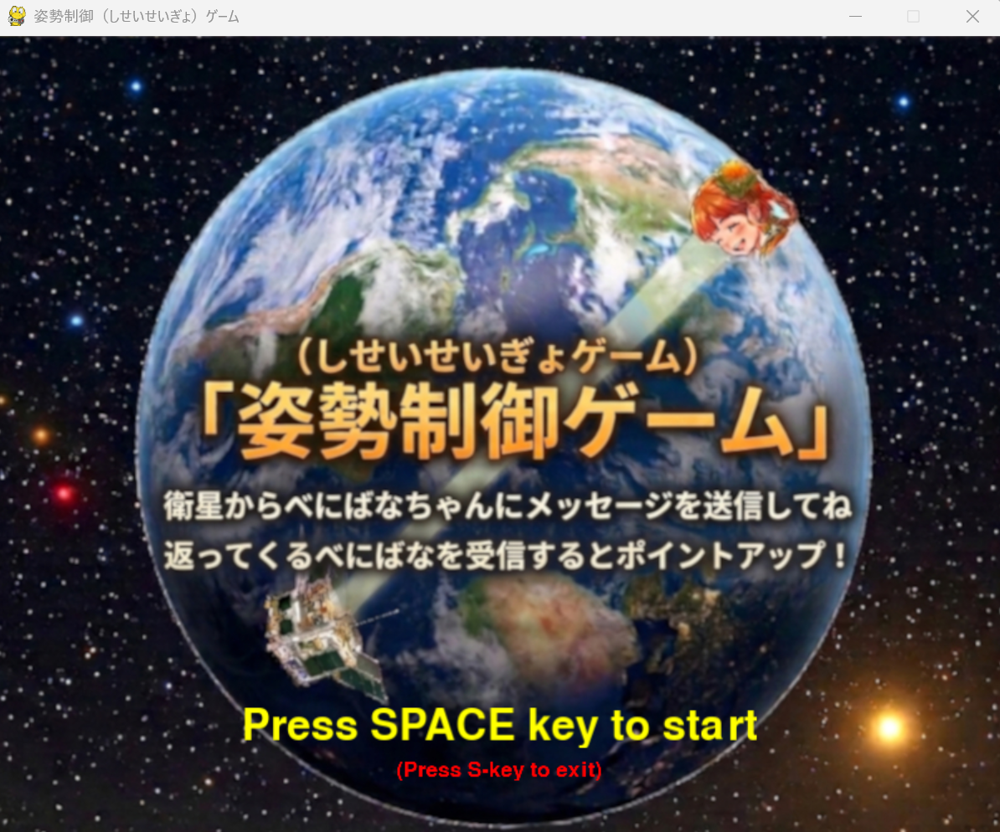
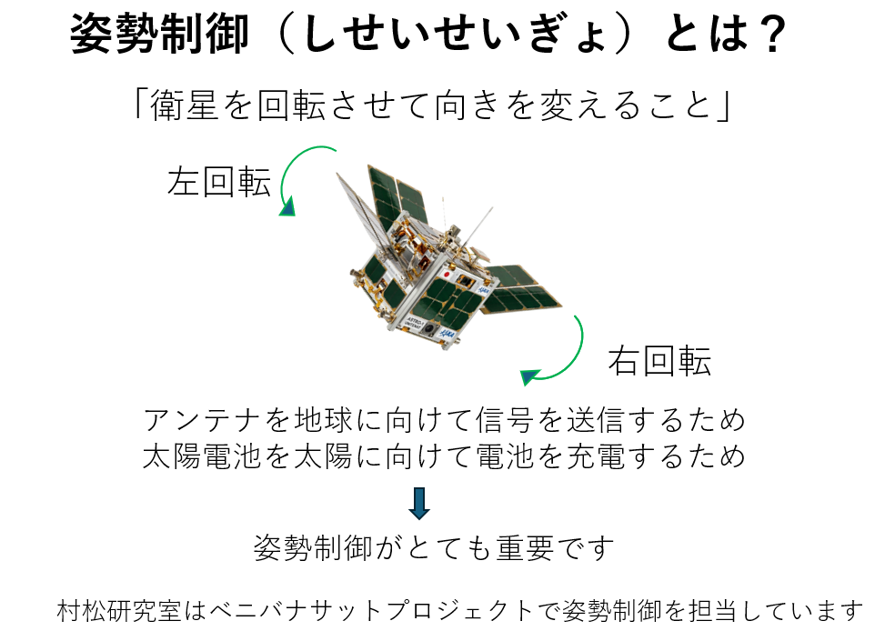
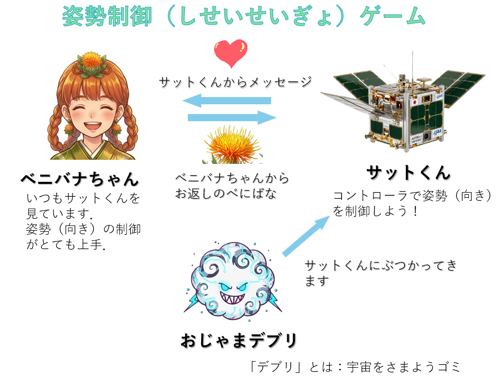
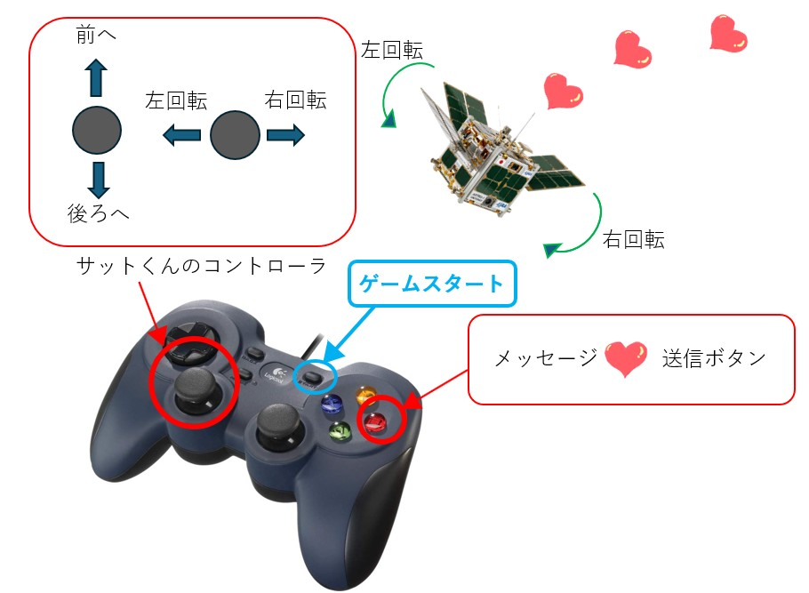
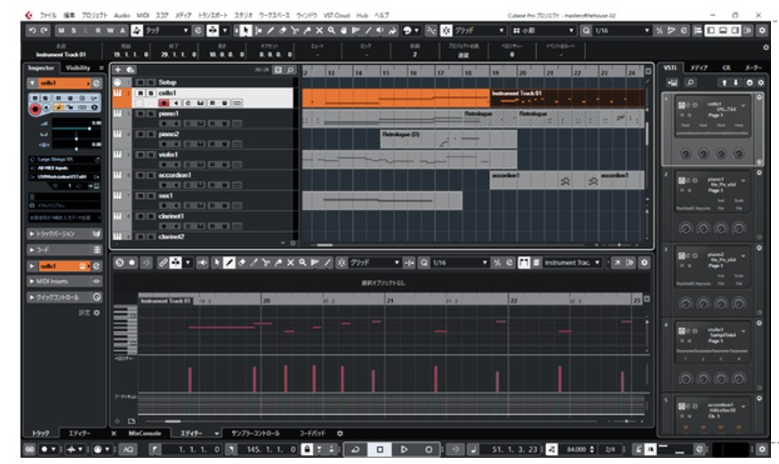

# 姿勢制御（しせいせいぎょ）ゲーム

2026年9月11日12日に米沢市伝国の杜で開催される「めーかーず・フェスタ」に出展するゲームです．

 

 

### プログラムのダウンロード
プログラムはこのリポジトリからダウンロードできます．
Pythonプログラムはbeni04.pyです．このプログラムが読み込む画像ファイルがフォルダimageに，音声ファイルがフォルダ
soundにあります．

### ライブラリのインストール
Pygameというライブラリを使いますので，
 
pip install pygame
 
でインストールしてください．

Pythonのバージョンは3.12がおすすめです．
### プログラムの実行
beni04.pyというPythonプログラムを実行するとゲームが始まります．音が発生しますので初めてのときはご注意ください．
過去の最高得点はscore01.txtに記録されます．
リセットしたい場合はscore01.txtをテキストエディタで開いて書き換えてください．

### 遊び方

 

### 人工衛星の操作
キーボードの矢印キーで衛星の前進後退，左右の回転を操作します．
スペースキーを押すとメッセージを送信します．
ゲームパッドがあればそれでも操作可能です（後述「ゲームパッド対応」）．

## プログラミング環境

Pythonを使用し，Pygameというライブラリを用いてゲームを開発しました．Pygameは2Dゲームを作成するためのライブラリで，画像ファイルをアニメーションで動かす，ゲームパッドを扱う，サウンドを再生するなどゲームに必要な機能を比較的容易にプログラミングできます．

## 制御工学の応用

プレーヤーが操作する人工衛星めがけてべにばなちゃんはべにばなを返信します．べにばなちゃんによる命中率を上げるために，人工衛星の速度から未来の位置を推定し，その情報をもとにべにばなちゃんの姿勢（回転角）を制御するプログラムを組み込まれています

## 突如現れるスペースデブリ

単調になりがちなシューティングゲームに，あるタイミングで登場するスペースデブリを導入しました．人工衛星に接近して接触すると吸着して人工衛星を強制的に移動させます．
 

## ゲームパッド対応
pygameライブラリを使ってゲームパッドを導入しました．人工衛星の移動とメッセージの送信はもちろん，他の機能も設定しました．

 
## 画像の生成

画像の生成にはAIを活用しました．べにばなちゃんや背景画像はGeminiを用いて作成しました．
 
## サウンドの創作

ゲームの効果音やBGMはSteinberg社の音楽作成ソフトウエア Cubase を用いて作成しました．
 

## プログラムの要点
スクリーン上にさまざなな画像を表示させ，あるフレームレートでそれらの画像の位置と角度を更新することでアニメーションが表示されます．
この画像表示にはpygame提供のscreen.blitを使うのですが，pygameデフォルトの座標軸と通常のxy座標軸が異なるため，
この違いを解消するためのdisp_imgという関数を作りました．

## 参考文献
「やさしいPython」高橋麻奈，SB Creative (2018) 
「Pythonでつくるゲーム開発入門講座」廣瀬豪，ソーテック（2019）
